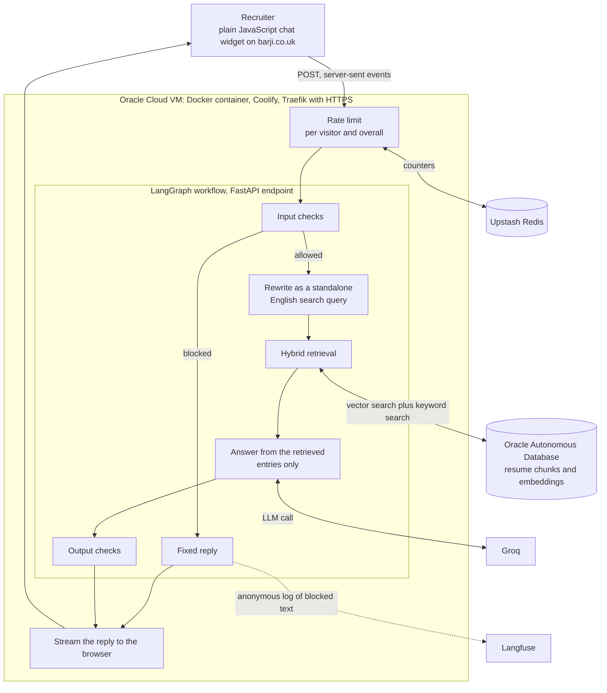
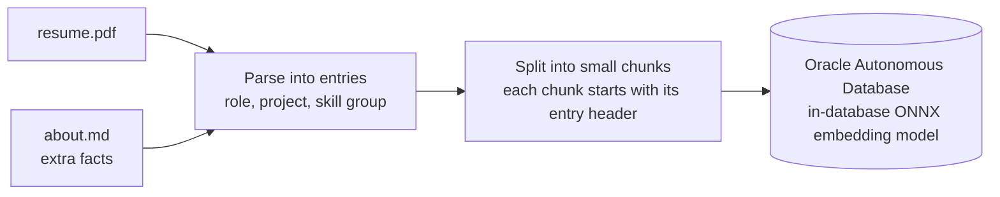
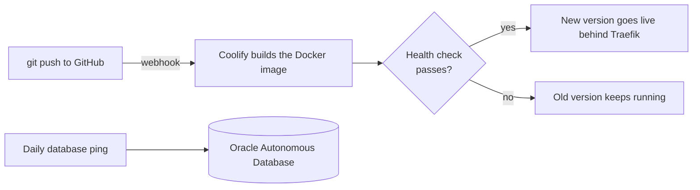

# Portfolio AI Assistant

A chatbot that answers recruiter questions about one person, Barjinder Singh, using only his resume and a short facts file as its source. It runs live on [barji.co.uk](https://barji.co.uk). Click "Ask about Barjinder" and try it.

I wrote this README for people who cannot see the code. The repository is private, because it holds the rules that keep the bot on topic. Anyone who wants a walkthrough of the code can ask me for one: barjinder028@gmail.com.

## What it does

- Answers questions about his roles, skills, projects, certifications, location and contact details.
- Says "not available" when the resume does not hold the answer. It does not guess.
- Refuses questions that are off topic, private, or an attempt to change its behavior.
- Understands questions in English, Hindi, Punjabi and a few other languages. It searches in English, because the resume is in English.
- Forgets the conversation when the page closes. Memory lives in server RAM, keyed by a random session id.

## Architecture

### Ingest, run once when the resume changes

### Deploy

## How one question moves through the system

1. The widget sends the question and a random session id.
2. The rate limiter checks the visitor and the total traffic. Counts live in Upstash Redis.
3. The input checks look for attempts to change the bot's behavior, private topics, and questions about the bot's own rules. Blocked questions get a fixed reply and never reach the model.
4. A short model call rewrites the question as a standalone search query. It uses the chat so far, so "what about his second job?" works. A question in another language becomes an English query.
5. Retrieval runs two searches. Oracle compares the query with chunk embeddings (vector search). A small keyword search runs in the app. The two rankings merge with reciprocal rank fusion.
6. The app does not hand the model the matching chunk alone. It hands over the whole entry the chunk came from, up to three entries.
7. The model answers from those entries only. If nothing relevant came back, a fixed sentence replaces the model call.
8. Output checks run before anything reaches the browser. The reply then streams word by word.

## Design choices

- Hybrid search. Vector search finds meaning ("what has he built with agents?"). Keyword search finds exact names ("AZ-900", "Amazon"). Each one misses what the other finds.
- Embeddings inside the database. Oracle Autonomous Database runs an ONNX embedding model, so the app needs no separate embedding service and no extra network hop.
- Whole entries, small chunks. Small chunks match well. Whole entries give the model the full context of a role or project.
- Fixed replies where possible. Off-topic questions, empty search results and questions about the bot's own rules get the same sentence each time. The model is not asked.
- Reply after checks. The graph finishes before streaming starts, so the output checks can stop a bad reply. The price is that the first word appears after the full answer is ready.
- No tools for the model. It cannot browse, run code, send email or read other data. A tricked model can only produce text from three resume entries.
- Free-tier friendly. Upstash, Langfuse, Groq and Oracle Always Free keep the running cost close to zero. A daily ping keeps the free database from going idle.

## Safety

The bot has layers: input checks, a model prompt that limits it to retrieved context, fixed replies, output checks, and rate limits. I tested it with a set of attack messages in several languages and a set of normal questions that must still pass. I read about 2026 research on prompt injection while building it. The research says no filter blocks every attack, so I do not call the bot injection-proof. I log blocked messages without any visitor identity, and I use them to improve the checks.

## Stack

- Python 3.11, FastAPI, LangGraph, LangChain Groq
- Oracle Autonomous Database (vector search, in-database ONNX embeddings)
- Groq for the language model
- Upstash Redis for rate limits and public counters
- Langfuse for anonymous logs of blocked messages
- Docker, Coolify, Traefik on an Oracle Cloud VM
- Plain JavaScript widget, no framework

## Quality

- More than 160 offline tests. They use a fake model, so they need no network, no database and no API key.
- Tests cover the input checks (attack messages in several languages and scripts), normal questions that must pass, query expansion, counters and logging.
- Five attack messages are marked as known gaps. A regex cannot catch them, so the prompt and the output checks have to.
- Health checks and an automatic deploy run on every push.

## How it was built

I planned the project and chose the stack. I built it by working with AI coding agents. I set the requirements, tested the bot with recruiter-style questions, and sent every wrong answer back to be fixed and checked again. I deployed and run it myself on my own Oracle Cloud server. I keep extending it.

## Contact

Barjinder Singh · Hyderabad, India · [barji.co.uk](https://barji.co.uk) · [LinkedIn](https://linkedin.com/in/barjindersingh1) · [GitHub](https://github.com/barjinder028) · barjinder028@gmail.com
